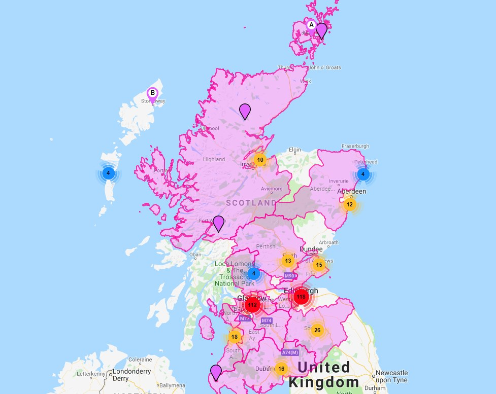
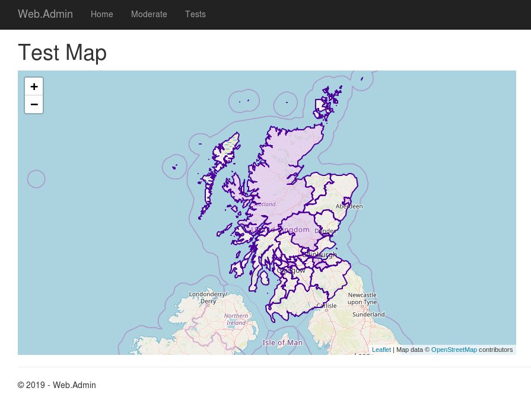
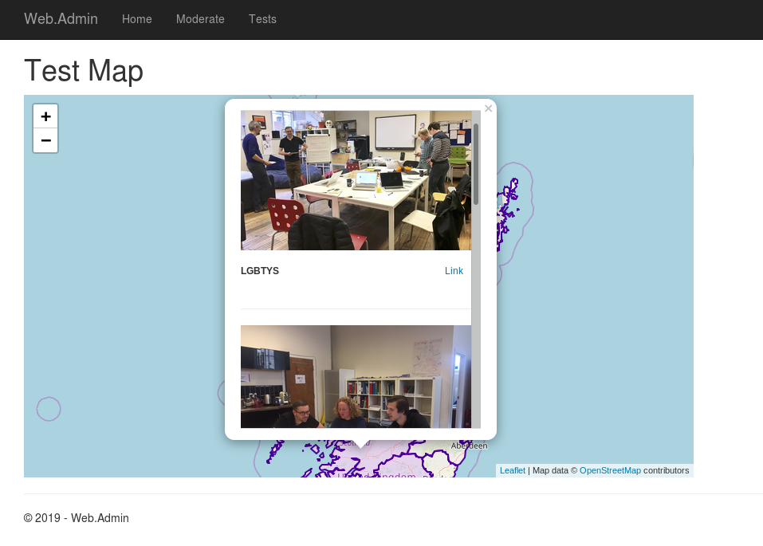

# A hackathon for charity
#### ... from the perspective of an opinionated developer

Having attended the [Digital For Good Meetup](https://www.meetup.com/Digital-For-Good/) on June 20th I joined up to the [Imapct 48](https://impact48.org/lgbt-youth-scotland/) weekend to help out LGBT Youth Scotland on July 7th, 8th and 9th.  The goal of the weekend was to produce a complete solution to help LGBT Youth manage an aspect their Purple Friday campaign for 2020.  I've done a couple of hackathons before and the idea of creating a "complete" solution seemed a little bit far fetched, but Barry (who was running the event) had done this before, was super enthusiastic and I like a challenge.

## Turning Scotland Purple ...

Everyone involved in the challenged assembled (fewer super powers, but just as much determination as when the Avengers did) at LGBT Youth's offices at 7pm on the Friday evening.

. Available at https://www.flickr.com/photos/patloika/7567539252/in/photolist-cwHBLG-p33VnV-bUPE3G-nGeB6J-nHZ5sa-cT9Gz3-nrMRev-ofhcKR-nHZ4Xn-efwdq3-K12Z5w-dRJywo-d7ecqb-nHZ5ca-d7eGg3-d7eKFo-d7dHhS-bMsttp-d7dLU7-nCgcft-d7cVzu-d7dLnd-d7eCGy-dNBuie-d7erro-4DNpUz-d7d2iG-d7eA43-ofhjDb-mjAs5K-mjCxoL-d7eMwL-d7dEmQ-dNH6ej-d7dvWC-d7dFpA-d7eN4N-d7cY1N-d7eKbN-d7cury-d7cvoQ-d7ew95-dkoYjC-d7dRmE-d7d9uw-djLtKi-bMsvBZ-d7eVG3-d7cD2w-ohiJxP")

The goal of this evening was to learn more about the challenge and come up with a plan we could execute before the end of Sunday.  The evening started with a presentation about what LGBT Youth does, what their Purple Friday campaign is about and the challenge they would like us to undertake.  In short, this year they solicited schools, councils, organisations and individuals to take pictures that had some purple in them, send them in with their location, the pictures would then be "pinned" to a digital map, each area showing how many pictures had been shared there.  This had cost them three people working on it full time and they were starting to push the boundaries of the free tier of the mapping software they were using.
Our job was to come up with a way to reduce the number of people required on the day, preferably to less than one, and to reduce the hosting costs.

*The map at the end of this years Purple Friday.*

To come up with a plan we started by jotting down ideas and questions as individuals for a couple of minutes before merging into larger and larger groups, merging similar ideas and discussing the others.  By the end of this process we had a rough plan for an MVP.

We would:
- listen to a Twitter stream for #PurpleFriday hashtags
- pin any images in those tweets to a map, slowly turning it purple
- allow someone at LGBT Youth to retroactively moderate any inappropriate images

Since there was no guarantee any of us would be around when PurpleFriday was actually happening we had to keep in mind that ideally the application should be simple to support as well.

And that was the end of Friday night.  Had I ever written a Twitter listener before? Nope.  Had I ever written a mapping application before?  Also, no, although Mark did mention [leafletjs](https://leafletjs.com/).  There was definitely going to be a lot of learning this weekend.  I went home and read the leafletjs tutorial, it looked relatively straight forward.

## ... in 48 hours ...

Saturday began the best way any Saturday does, with breakfast roles.  After a bit of discussion it became clear that everyone who was there basically fitted into one of two groups, those of use who could help develop the app and those of us that could help develop a digital marketing campaign.  We split into two groups down those lines and agreed to do mini standups every hour or so to share our progress (hopefully there's a blog about what the digital marketers did somewhere I can link to, as that stuff went way over my head).  Myself, Barry and Mark were the developers who were going to be around for at least all of Saturday, so as [Conway's law](https://en.wikipedia.org/wiki/Conway%27s_law) dictated we created 3 components for the system, that's what we did.
- A Tweet listener that would filter, format and forward relavent tweets to the web server
- A web sever to store tweets and serve the frontend
- A front end consisting of a map displaying where the tweets had been made from

The first thing we decided on was the data format for sending data from the Tweet listener to the web server and from the web server to the frontend.  This decoupled us and allowed each of us to work relatively indpendently.  Given the skills we had available we decided to build the Tweet listener and web server using .Net Core and the frontend in JavaScript.  With my backend weapon of choice these days being Clojure, Mark took on the Tweet listener and Barry worked on the web server.  This left me to fumble around with some 5 year old JavaScript skills I might have once possessed.

The rest of the day was a series of small and awesome wins, getting a map I had defined to display, drawing the boundaries of Scottish councils rather than just sticking pins in the map, colouring those polygons depending on the number of tweets depending on the number of tweets from that area, retrieving data from the server rather than hard coded data, showing each of the images from the tweets from a given council area.

By the end of Saturday we had a product that worked for the happy path, which we could run from our development laptops.  The code I had written wasn't pretty, there was inlined CSS and JavaScript in HTML files, it was a mixture of the JavaScript I remember from 5 years ago, Googled snippets and entire functions "borrowed" from Stackoverflow, but it worked ... mostly.

## ... ish

Sunday we started with a recap of Saturday and came up with a list of "must haves" and "nice to haves".  Mark had headed back down south Saturday evening and we had been joined by Matt.  Again, we had regular small standups and focused on finishing the "must haves" and getting the app deployed.  It was all a bit less dramatic than Saturday, a lot of filing off the rough edges we had ignored so far, but could no longer.  Barry worked on retroactive moderation, with Mark working on the required authentication and documentation for the whole project.  Matt worked on packaging up (and no doubt cleaning up) the JavaScript code we had and I worked on finding a hosting solution and then writing deployment scripts.  

There were fewer wins on Sunday, but still some, including learning how to deploy .Net Core apps onto a Linux box. We didn't quite manage to complete everything on the "must have" list.  We stopped about 4pm, both groups presented where they had gotten to before heading to the Roseleaf for a couple of pints.

*The new app, so far*

## What now?

We nearly got there.  Everything that is left to do is recorded in the [issues on the GitHub project](https://github.com/impact48/PurpleFriday/issues), there's talk of running another hackathon to get those done, or hopefully someone will feel inspired to pick them up between now and February 2020.

## Was it a success?

I think, on balance, it was.  I was a little disappointed that we didn't get it over the line, but working with everyone in tight iterations and the multiple wins throughout the weekend made for a very enjoyable time.  So, as developers, what were the keys to our success?
- Friday evening planning, during which we aggresively descoped to a minimal MVP
- Deciding on the data formats that would be passed between the components very early on
- Coming back together for small standups to show where we were every hour or two
